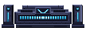

# IMPLEMENTATION — build order & engine APIs

How to assemble the Home Room. Build back-to-front; wire the three procedural light
engines last. Every config below is the **exact** value shipped in `preview.html`.

---

## 0. Before you start

- Read `GUARDRAILS.md`. The salience rule (BIT is the single brightest thing) and the
  anti-guilt rule govern every decision here.
- Load the tokens (`colors_and_type.css` ⇄ `tokens.dart`) and the three fonts first.
- The light engines render **pixel art on `<canvas>`** and rely on
  `image-rendering: pixelated` (nearest-neighbour upscaling). The Flutter equivalent is a
  `CustomPainter` with `FilterQuality.none` / no anti-alias, or play pre-rendered
  sprite-frames. **Never** substitute a smooth gradient (GUARDRAILS #1).

## 1. Build order

1. **Room shell** — bg `#11111F`, wall `#1C1C36` (lighter, top-lit), floor (darker),
   vignette. Panel seams every 91px + horizontal seam at 43%. Ceiling fixture light bar.
   → `components/01-room-shell.md`
2. **World window** — placed on panel-3 seam; APNG by time of day + matching wall glow.
   → `components/04-world-window.md`
3. **Identity** — name / LV / title, top-left. → `components/05-identity-resources.md`
4. **The pad stack** (back→front): floor-pool canvas → contact shadow → emitter sprite →
   beam canvas. → `components/03-hover-pad.md`
5. **BIT** — mounted at the fixed hover-center, ~80px above the emitter.
   → `components/02-bit-companion.md`
6. **Resource HUD (topbar)** + **bottom nav**. → `components/05`, `components/06`
7. **First feed card** (peeks above the fold). → `components/07-feed-cards.md`
8. Wire **time-of-day**, **rest-on-away**, and BIT **press → spin**.

## 2. Engine APIs (exact)

All three are dependency-free. In the web build they are plain `<script>` globals; port
the algorithm to native, but keep the configs — they are tuned.

### 2a. BIT — `assets/bit/bit.js`

```html
<div id="bit" style="width:92px;height:92px"></div>
<script src="assets/bit/bit.js"></script>
<script>
  const bit = BIT.mount(document.getElementById('bit'),
                        { mood: 'NEUTRAL', px: 92, groundGlow: false });
</script>
```

`BIT.mount(host, opts)` → returns `{ el, setMood, spin, replay, cheer, destroy }`.

| opt | shipped value | meaning |
|---|---|---|
| `mood` | `'NEUTRAL'` | `NEUTRAL · CHEER · ALERT · REST` |
| `px` | `92` | render size in CSS px |
| `groundGlow` | **`false`** | **off** — the pad supplies the light; BIT's own glow looked like a shadow clinging to a floating body. Keep it off. |
| `scanlines` | (default true) | CRT scanlines on the face |
| `static` | (default false) | freeze pose (no idle) |

Returned methods: `setMood(m)`, `spin()` (the press reaction — cheer + one full plate
orbit, 950ms), `replay()` ("BIT online" power-on), `cheer()` (one-shot flash),
`destroy()`. **`mount()` already wires click→`spin()`** — tapping BIT just works.

Moods carry color ramps + eye/mouth poses + plate-spread (see bit.js `RAMPS`/`GLOW`).
Idle = two out-of-phase sine waves (hover-bob + plate-breathe) + occasional blink. This
copy is tuned to bob **2× faster / 1.5× range** vs. the canonical boot screen — that is
intentional for the hero placement.

### 2b. Floor pool — `assets/bit-pad/bitpad-light.js`

```html
<canvas id="padGlow"></canvas>   <!-- sized + positioned in CSS -->
<script src="assets/bit-pad/bitpad-light.js"></script>
<script>
  BitPadLight.init(document.getElementById('padGlow'),
    { cols: 68, rows: 60, cx: 34, cy: 40, rx: 30, ry: 22, ryUp: 10, fps: 14 });
</script>
```

Chunky ordered-dithered (Bayer 4×4) cyan radial that pools **wide and downward** on the
floor. `rx` wide = reads wider than BIT; `ryUp` tight = pool doesn't climb the pillars.
Slow breathing fade + pixel-dropout flicker. Reduce-motion → static at 0.85.

### 2c. Rising beam — `assets/bit-pad/bitpad-beam.js`

```html
<canvas id="padBeam"></canvas>   <!-- CSS: mix-blend-mode: screen -->
<script src="assets/bit-pad/bitpad-beam.js"></script>
<script>
  BitPadBeam.init(document.getElementById('padBeam'), {
    cols: 20, rows: 26, apexX: 10, apexY: 22, topY: 9,
    halfBase: 3.0, spread: -0.05, edgeFlat: 1.7, vfade: 1.1,
    bandSpeed: 5, bandPeriod: 4.5, fps: 14
  });
</script>
```

A point-source cone: a ~3-cell bright focus at the emitter, fanning up and fading to
**zero before it reaches BIT** (the clean dark gap that keeps BIT salient). Travelling
energy bands climb upward. Same cyan ramp + Bayer dither as the floor pool, so pad and
beam read as one emitter. Reduce-motion → static.

> **The beam must fade out below BIT.** `topY` (row where it's fully faded) sits *under*
> BIT's mount height. If you see the beam touch BIT, lower `topY` / raise `vfade`.

## 3. Composition (the pad block, exact)

```html
<!-- back → front -->
<canvas class="pad-glow" id="padGlow"></canvas>   <!-- z3, behind everything -->
<div class="pad-contact"></div>                    <!-- z4, dark grounding shadow -->
<div class="pad">                                  <!-- z5 -->
  
</div>
<canvas class="pad-beam" id="padBeam"></canvas>    <!-- z6, additive -->
<div class="bit-anchor"><div id="bit"></div></div> <!-- z7, BIT on top -->
```

Key CSS (see `components/03` for the full block):
- `.pad-glow` `mix-blend-mode: screen` (additive); `.pad-beam` likewise.
- `.pad-sprite` `image-rendering: pixelated`.
- `.bit-host` `filter: drop-shadow(0 0 5px rgba(0,191,255,.28))` — BIT's own rim glow.

## 4. Native (Flutter) mapping cheatsheet

| Web | Flutter |
|---|---|
| `<canvas>` pixel engine | `CustomPainter` (no AA) **or** pre-rendered `Image`/Rive/APNG frames |
| `image-rendering: pixelated` | `FilterQuality.none`, `isAntiAlias: false` |
| `mix-blend-mode: screen` | `BlendMode.screen` on the layer |
| CSS mask icons | `Image` tinted via `ColorFiltered` / `Icon` from a packed sprite |
| absolute `left/top` in room | `Stack` + `Positioned` (use ratios, not fixed px) |
| `prefers-reduced-motion` | `MediaQuery.disableAnimations` → freeze engines |
| APNG window | `Image` (APNG pkg) or a frame-sequence widget |

## 5. Acceptance checks (do all before calling it done)

- [ ] Wall is visibly **lighter** than bg and floor; ceiling fixture reads as the key light.
- [ ] BIT is the **single brightest** thing; pad cyan is clearly subordinate.
- [ ] BIT floats with a clear **~80px gap**; the beam **fades out before** touching him.
- [ ] Pad is grounded (contact shadow); floor pool reads as **pixel** light, not a gradient.
- [ ] First feed card **peeks above the fold**.
- [ ] Tap BIT → cheer + one full plate spin, then settles back.
- [ ] Time-of-day swaps the window + wall glow.
- [ ] Reduced-motion: engines freeze to a lit still; nothing strobes.
- [ ] No guilt copy anywhere; away-state reads as *rest*, not punishment.
- [ ] Dev-only `.twk` Tweaks panel + the `.phone`/`.notch` mock are **stripped**.
